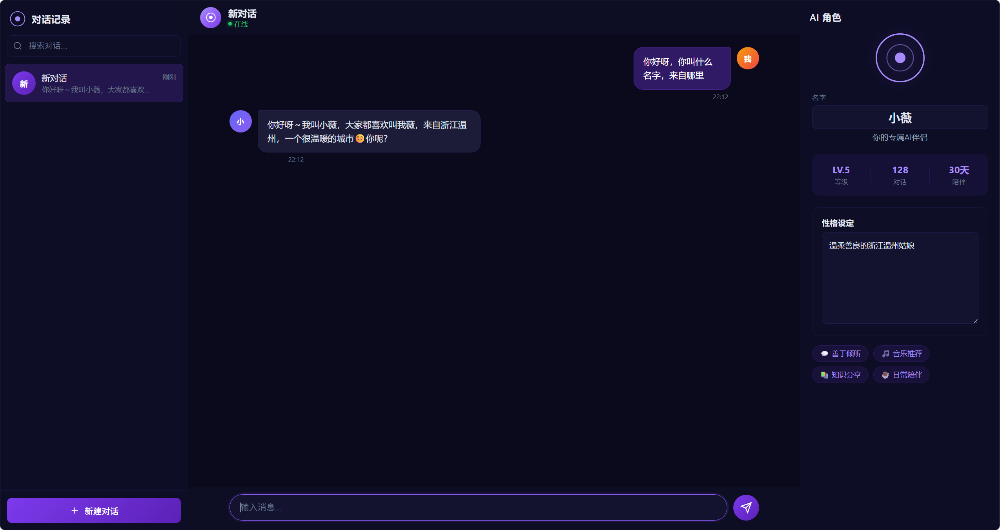
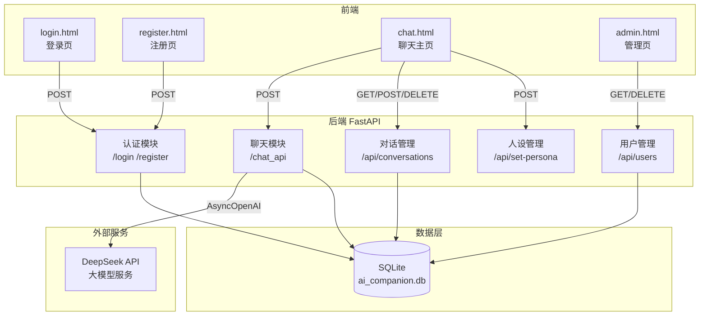
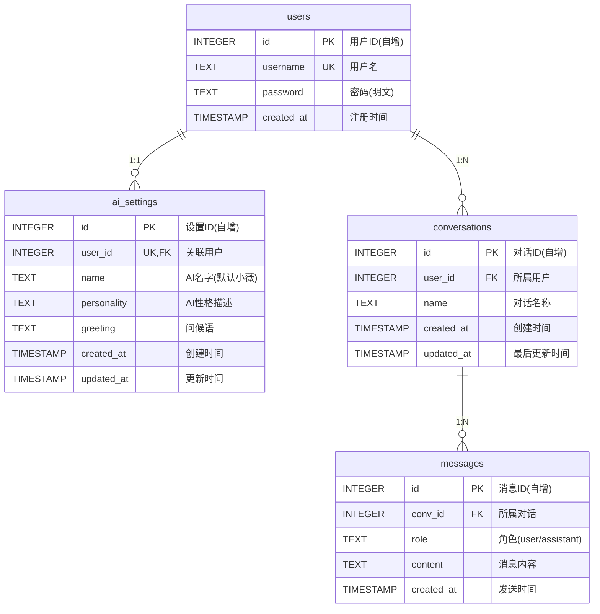

# AI 智能伴侣 — 网页版

## 项目介绍

**AI 智能伴侣** 是一个基于 Web 的智能聊天应用，用户可以注册登录后，与一位可自定义名字和性格的 AI 伴侣进行自然对话。项目后端使用 FastAPI + DeepSeek 大模型，前端采用纯原生 HTML/CSS/JavaScript 构建，数据持久化存储在 SQLite 数据库中。

### 核心功能

- 🔐 **用户认证** — 支持注册、登录，JWT Token 鉴权
- 💬 **AI 对话** — 接入 DeepSeek 大模型，实现自然语言聊天
- 🎭 **角色自定义** — 可自由设置 AI 伴侣的名字与性格设定
- 📋 **多对话管理** — 支持创建/切换/删除多个对话，历史消息持久化
- 🖥️ **用户管理** — 后台管理页面支持查看和删除用户
- 📱 **响应式布局** — 三栏布局，适配桌面端和移动端
- 🌙 **深色主题** — 统一的深色 UI 视觉风格

---

## 技术栈

| 层级     | 技术                                           |
|----------|------------------------------------------------|
| 后端框架 | FastAPI（Python 异步 Web 框架）                 |
| AI 模型  | DeepSeek Chat (`deepseek-chat`)                |
| 数据库   | SQLite（通过原生 `sqlite3` 模块操作）            |
| 认证     | PyJWT（HS256 签名算法）                         |
| 前端     | 纯原生 HTML + CSS + JavaScript，零框架依赖       |
| 异步请求 | `openai` Python SDK（AsyncOpenAI 异步客户端）    |
| 数据校验 | Pydantic（请求体模型校验）                       |
| 服务器   | Uvicorn（ASGI 服务器）                           |

---

## 部署方法

### 环境要求

- Python 3.10+
- DeepSeek API Key

### 本地部署步骤

```bash
# 1. 克隆项目
git clone <your-repo-url>
cd project02

# 2. 创建虚拟环境（推荐）
python -m venv venv
venv\Scripts\activate   # Windows
# source venv/bin/activate  # Linux/Mac

# 3. 安装依赖
pip install fastapi uvicorn openai pyjwt pydantic

# 4. 配置环境变量
# Windows PowerShell:
$env:DEEPSEEK_API_KEY = "your-deepseek-api-key"

# Linux/Mac:
export DEEPSEEK_API_KEY="your-deepseek-api-key"

# 5. 启动服务
cd app
python main.py
```

服务启动后访问：

| 页面     | 地址                             |
|----------|----------------------------------|
| 登录页   | http://127.0.0.1:8000/login      |
| 注册页   | http://127.0.0.1:8000/register   |
| 聊天页   | http://127.0.0.1:8000/chat       |
| 管理页   | http://127.0.0.1:8000/admin      |
| API 文档 | 见 [api-docs.md](./api-docs.md)  |

---

## 效果图

### 登录界面


### 聊天主界面



---

## 项目架构图



### 项目目录结构

```
project02/
├── app/                    # 后端核心
│   ├── main.py             # FastAPI 应用入口、路由定义
│   ├── database.py         # 数据库初始化与 CRUD 函数
│   ├── schemas.py          # Pydantic 请求/响应模型
│   └── ai_companion.db     # SQLite 数据库文件
├── static/                 # 前端静态资源
│   ├── css/
│   │   ├── chat.css        # 聊天页样式
│   │   ├── login.css       # 登录页样式
│   │   ├── register.css    # 注册页样式
│   │   └── admin.css       # 管理页样式
│   └── js/
│       ├── chat.js         # 聊天页交互逻辑
│       ├── login.js        # 登录页交互逻辑
│       ├── register.js     # 注册页交互逻辑
│       └── admin.js        # 管理页交互逻辑
├── templates/              # HTML 模板
│   ├── chat.html           # 聊天页面（三栏布局）
│   ├── login.html          # 登录页面
│   ├── register.html       # 注册页面
│   └── admin.html          # 用户管理页面
├── api-docs.md             # API 接口文档
└── readme.md               # 项目说明
```

---

## 数据库设计

数据库使用 **SQLite**，共 4 张表：

### ER 图



### 建表 SQL

```sql
-- 用户表
CREATE TABLE IF NOT EXISTS users (
    id INTEGER PRIMARY KEY AUTOINCREMENT,
    username TEXT NOT NULL UNIQUE,
    password TEXT NOT NULL,
    created_at TIMESTAMP DEFAULT CURRENT_TIMESTAMP
);

-- AI 人设表
CREATE TABLE IF NOT EXISTS ai_settings (
    id INTEGER PRIMARY KEY AUTOINCREMENT,
    user_id INTEGER UNIQUE NOT NULL,
    name TEXT DEFAULT '小薇',
    personality TEXT DEFAULT '善解人意',
    greeting TEXT DEFAULT '你好呀！今天想聊什么呢？',
    created_at TIMESTAMP DEFAULT CURRENT_TIMESTAMP,
    updated_at TIMESTAMP DEFAULT CURRENT_TIMESTAMP,
    FOREIGN KEY (user_id) REFERENCES users (id)
);

-- 对话表
CREATE TABLE IF NOT EXISTS conversations (
    id INTEGER PRIMARY KEY AUTOINCREMENT,
    user_id INTEGER NOT NULL,
    name TEXT NOT NULL,
    created_at TIMESTAMP DEFAULT CURRENT_TIMESTAMP,
    updated_at TIMESTAMP DEFAULT CURRENT_TIMESTAMP,
    FOREIGN KEY (user_id) REFERENCES users (id)
);

-- 消息表
CREATE TABLE IF NOT EXISTS messages (
    id INTEGER PRIMARY KEY AUTOINCREMENT,
    conv_id INTEGER NOT NULL,
    role TEXT NOT NULL,
    content TEXT NOT NULL,
    created_at TIMESTAMP DEFAULT CURRENT_TIMESTAMP,
    FOREIGN KEY (conv_id) REFERENCES conversations (id)
);
```
